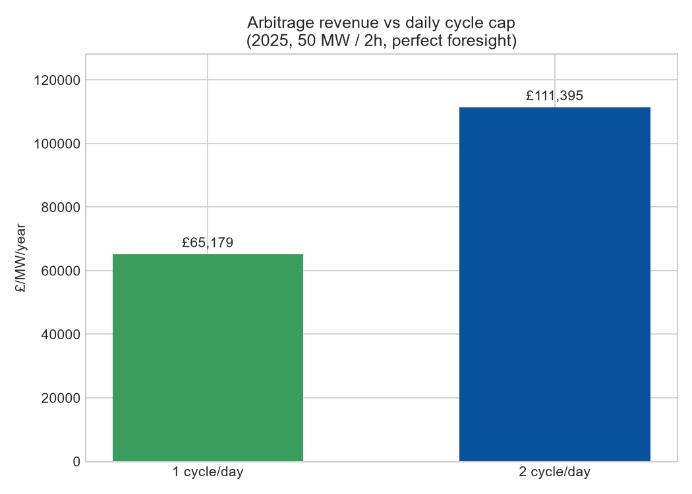
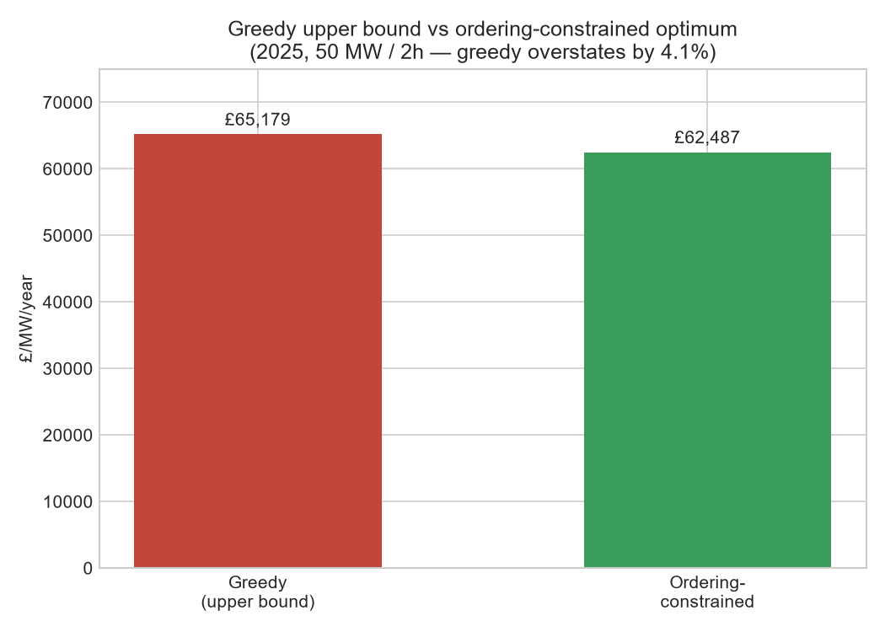
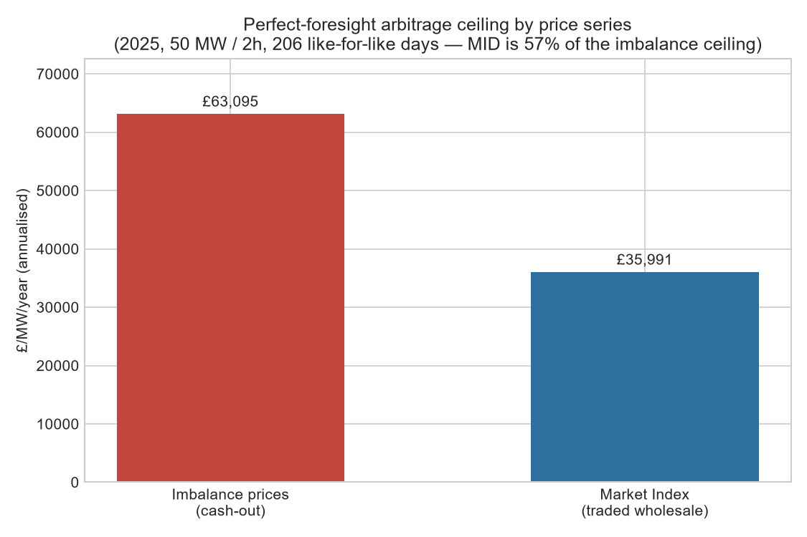

# GB BESS Arbitrage Dashboard

A Python analysis of how much a grid-scale battery in Great Britain could earn from wholesale electricity price arbitrage — and how that compares with what GB batteries actually earn across all their revenue streams. The goal is to demonstrate an understanding of the GB BESS market, not just to make charts.

---

## Project summary

Battery Energy Storage Systems (BESS) in Great Britain earn revenue from several sources: wholesale price arbitrage, the Balancing Mechanism, frequency response services (FFR, DC), and the Capacity Market. This project isolates the wholesale arbitrage component, computes a theoretical upper bound using full-year 2025 half-hourly imbalance prices, and contextualises it against published real-world BESS revenue figures (~£72k/MW/year across all streams). The gap between the oracle ceiling and real-world earnings shows concretely why revenue stacking — not pure arbitrage — defines the GB BESS investment case.

---

## Data source

**Elexon Insights API** — free, public, no API key required.

- Base URL: `https://data.elexon.co.uk/bmrs/api/v1`
- Endpoint used: `/balancing/settlement/system-prices/{date}?format=json`
- Returns 48 half-hourly settlement (imbalance) prices per day.
- **Single imbalance price:** GB moved to a single cash-out price in 2015 (BSC modification P305), so the System Sell Price and System Buy Price are identical in every period. Verified across the full dataset: `sell != buy` in **0 of 17,520 rows**. This project keeps both columns for transparency but uses their common value as the price series.

> **Note on price series:** Settlement (imbalance) prices are more volatile than day-ahead or intraday market prices, because they reflect real-time scarcity. Using them for arbitrage modelling produces a higher — and less achievable — ceiling than a day-ahead price series would. See Caveats below.

---

## Battery assumptions

| Parameter | Value |
|---|---|
| Nameplate power | 50 MW |
| Usable capacity | 100 MWh |
| Duration | 2 hours |
| Round-trip efficiency | 85% (applied at discharge: energy out = energy in × 0.85) |
| Cycle limit | 1 full cycle per day (100 MWh in, 85 MWh out) |

---

## Method

**Greedy perfect-foresight ("oracle") arbitrage:**

For each day, the model sorts all 48 half-hourly prices and:
1. Charges in the 4 cheapest periods (50 MW × 0.5 h × 4 = 100 MWh drawn from the grid).
2. Discharges in the 4 most expensive periods (100 MWh × 0.85 RTE = 85 MWh delivered to the grid).
3. Skips the day if net revenue would be negative.

This is an **upper bound** — it assumes perfect knowledge of future prices. A real battery bids into markets without knowing what prices will do.

---

## Key findings (2025)

| Metric | Value |
|---|---|
| Oracle arbitrage ceiling | **£65,179 /MW/year** |
| Best month | January 2025 — £11,080/MW |
| Best single day | 8 January 2025 — £245,881 on the 50 MW battery |
| Worst month | December 2025 — £3,458/MW |
| Real GB BESS revenues (all streams) | ~£72,000 /MW/year |

**January 2025 dominance:** On 8 January, a cold spell combined with low wind drove settlement prices to £2,900/MWh in some periods. A single day contributed ~£246k — more than any other month except January itself. This illustrates a key feature of GB imbalance prices: they are mean-reverting but fat-tailed. Arbitrage revenue is not steady; it is concentrated in a handful of stress events.

**The gap is the story:** The oracle arbitrage ceiling of ~£65k/MW sits *below* what batteries actually earn (~£72k/MW). Pure arbitrage — even at the theoretical maximum — does not explain BESS revenues in GB. Frequency response, the Balancing Mechanism, and the Capacity Market are what close (and exceed) the gap.


*Daily perfect-foresight P&L across 2025. The 8 January scarcity spike (~£246k in a single day) dwarfs every other day — arbitrage revenue is concentrated in a handful of events, not earned steadily.*

---

## Revenue comparison: arbitrage vs the real revenue stack

`revenue_comparison.py` places the oracle arbitrage ceiling next to the *actual* GB BESS revenue stack for 2025. The real-world stack below uses **published industry benchmarks** (£/MW/year) — it is **not** computed from raw data, because granular per-asset revenue sits behind paywalls (Modo Energy, Cornwall Insight, LCP Delta). These figures are used the same way a BESS investment analyst uses them for initial screening: as sourced approximations, clearly labelled.

| Revenue stream | £/MW/year | Share | Source basis |
|---|---|---|---|
| Balancing Mechanism | 28,000 | 39% | Modo Energy BESS Revenue Tracker 2025 |
| Frequency response (DC etc.) | 18,000 | 25% | NESO DC procurement + Modo Energy |
| Wholesale arbitrage (achieved) | 15,000 | 21% | Implied: oracle × typical day-ahead capture |
| Capacity Market | 7,000 | 10% | NESO CM auction results (public) |
| Other (DM, DR, triad) | 4,000 | 6% | Cornwall Insight estimates |
| **Total** | **72,000** | | |

Two numbers carry the message:
- **£65k** — the oracle arbitrage *ceiling* (perfect foresight on imbalance prices).
- **£15k** — *achieved* arbitrage within the real stack, just **~23% of that ceiling**.

No operator captures the full spread: forecasts are imperfect and the largest spikes (8 January's £2,900/MWh) are nearly impossible to position for in advance. Arbitrage is a supporting player (~21% of revenue); the Balancing Mechanism and frequency response dominate. This is why GB BESS economics are about **revenue stacking**, not arbitrage alone.


---

## Duration sensitivity (1h / 2h / 4h)

`duration_sweep.py` reruns the oracle model at different durations, holding power fixed at 50 MW, to surface the live GB "how long should a battery be?" trade-off.

| Duration | Capacity | £/MW/year | £/MWh-of-capacity/year | vs 2h |
|---|---|---|---|---|
| 1-hour | 50 MWh | £36,010 | £36,010 | −45% |
| 2-hour | 100 MWh | £65,179 | £32,589 | (base) |
| 4-hour | 200 MWh | £111,395 | £27,849 | +71% |

**The trade-off in one table:** revenue *per MW of power* rises steeply with duration (+71% for a 4-hour battery), because longer batteries capture more of each price spike — on 8 January, prices sat at £2,900/MWh for eight consecutive half-hours, but a 2-hour battery can only discharge into four of them. Yet revenue *per MWh of capacity* falls with duration: each additional MWh is dispatched onto shallower, less profitable parts of the price curve. This is exactly why GB has seen a shift toward longer-duration (2h→4h) batteries even as the per-MWh return diminishes.


---

## Cycling sensitivity (1 vs 2 cycles/day)

`cycles_sweep.py` relaxes the one-cycle-per-day cap. A second daily cycle exploits the next-best spread, lifting the ceiling from £65,179 to **£111,395/MW/yr (+71%)**.

| Cycle cap | £/MW/year | vs 1 cycle |
|---|---|---|
| 1 cycle/day | £65,179 | (base) |
| 2 cycles/day | £111,395 | +71% |

**Note the equivalence:** a 2-hour battery cycling *twice* captures the same 8 cheapest + 8 dearest half-hours as a 4-hour battery cycling *once* — hence the identical £111,395. The difference is in the cost base: extra cycles buy that revenue with **battery wear** rather than extra **capex**. Warranties are written around a fixed number of equivalent full cycles per year, so much of the uplift can be eaten by degradation — which is why the base case stays at 1 cycle/day.



---

## How loose is the upper bound? (ordering-constrained oracle)

The greedy model takes the 4 cheapest and 4 dearest half-hours regardless of *when* they occur — so it can implicitly "sell before it buys", which a battery starting empty cannot do. `ordering_oracle.py` computes the true state-of-charge-respecting optimum with a small dynamic program and compares:

| Model | £/MW/year |
|---|---|
| Greedy (base, ignores order) | £65,179 |
| Ordering-constrained optimum | £62,487 |

The greedy headline overstates by just **4.1%**. On most days the cheapest periods already precede the dearest (overnight trough → evening peak), so ordering rarely binds — confirming the £65,179 figure is a genuine, only-modestly-loose upper bound on this axis.



---

## Imbalance vs traded wholesale prices (the biggest caveat, quantified)

The base model runs on **imbalance (cash-out) prices**, which are far more volatile than the prices a battery actually trades against. `market_index_compare.py` reruns the oracle on the **Market Index Price (MID)** — the volume-weighted price of real short-term wholesale trades (Elexon `datasets/MID`, volume-weighted across the APX and N2EX providers) — and compares like-for-like.

MID has untraded (zero-volume) overnight periods, so only 206 days have a complete 48-period profile. To avoid conflating "lower prices" with "fewer days", both series are measured over those **same 206 days** and annualised:

| Price series | Over 206 common days | Annualised £/MW/yr |
|---|---|---|
| Imbalance (cash-out) | £35,610 | £63,095 |
| Market Index (traded wholesale) | £20,313 | £35,991 |
| **MID as share of imbalance** | **57%** | |

The annualised common-day imbalance figure (£63,095) is close to the full-year headline (£65,179), confirming the 206 days are broadly representative. The takeaway: stripping out the £2,900/MWh cash-out spikes roughly halves the ceiling. **Realistic perfect-foresight wholesale arbitrage is closer to ~£36k/MW than to the £65k imbalance headline** — the clearest single reason to read £65,179 as an upper bound, not an achievable target.



---

## Tests

`test_arbitrage.py` runs a set of synthetic-data sanity checks on the core logic (RTE application, greedy-vs-ordered relationships, the cycle monotonicity, and the settlement-period→UTC mapping). No downloaded data needed, so it runs in CI on a clean checkout:

```bash
python test_arbitrage.py
```

A GitHub Actions workflow (`.github/workflows/tests.yml`) runs it on every push.

---

## Caveats

- **Perfect foresight overstates achievable arbitrage.** A real battery cannot know future prices. Day-ahead price forecasting typically captures 60–80% of the oracle spread.
- **Imbalance prices are more volatile than traded prices.** This is now quantified (see the Market Index section): on like-for-like days, the traded-wholesale ceiling is ~57% of the imbalance ceiling (~£36k vs ~£63k annualised). The £65k headline is an imbalance-price upper bound, not a realistic day-ahead arbitrage estimate.
- **Clock-change days skipped.** 30 March (46 periods, BST transition) and 26 October (50 periods, GMT transition) are excluded — 2 of 365 days.
- **One-cycle-per-day cap.** The base model does not allow partial or multiple cycles. The cost of this assumption is quantified in the cycling-sensitivity section (a 2nd cycle adds +71% but doubles wear); the cap is retained to reflect realistic warranty/degradation limits.
- **The real-world revenue stack is benchmark-based, not computed.** The £72k/MW figure and its breakdown come from published industry sources (see the table above), not from raw market data. The "achieved arbitrage" line (£15k) is itself a benchmark estimate, internally consistent with the ~23% capture rate but not independently derived here.

---

## How to run

```bash
# 1. Create and activate the virtual environment
python -m venv venv
.\venv\Scripts\activate        # Windows PowerShell
# source venv/bin/activate    # macOS / Linux

# 2. Install dependencies
pip install -r requirements.txt

# 3. Fetch a full year of half-hourly prices (skips months already downloaded)
python fetch_prices.py

# 4. Run the arbitrage simulation
python simulate_arbitrage.py

# 5. Compare against the real-world BESS revenue stack
python revenue_comparison.py

# 6. Duration sensitivity sweep (1h / 2h / 4h)
python duration_sweep.py

# 7. Cycling sensitivity (1 vs 2 cycles/day)
python cycles_sweep.py

# 8. How loose is the upper bound? (ordering-constrained oracle)
python ordering_oracle.py

# 9. Imbalance vs traded wholesale (Market Index) comparison
python market_index_compare.py

# 10. Build the self-contained HTML dashboard (opens in your browser)
python build_dashboard.py

# Run the sanity tests
python test_arbitrage.py
```

Outputs are saved to `data/` (gitignored — re-fetch locally):
- `data/prices_2025-MM.csv` — raw monthly price files
- `data/prices_2025-all.csv` — combined annual file
- `data/arbitrage_results.csv` — daily P&L breakdown
- `data/daily_pnl_plot.png` — full-year arbitrage chart
- `data/revenue_comparison.png` — arbitrage ceiling vs real revenue stack
- `data/duration_sweep.png` — revenue by battery duration
- `data/cycles_sweep.png` — revenue by daily cycle cap
- `data/ordering_oracle.png` — greedy vs ordering-constrained optimum
- `data/mid_2025-all.csv` — cached Market Index prices
- `data/market_index_compare.png` — imbalance vs traded-wholesale ceiling

`dashboard.html` (project root) is a single self-contained file with all data embedded — open it directly in any browser.

---

## Project structure

```
bess-arbitrage/
├── fetch_prices.py         # Downloads Elexon half-hourly prices → data/
├── simulate_arbitrage.py   # Oracle arbitrage model → daily P&L + chart
├── revenue_comparison.py   # Arbitrage ceiling vs real revenue stack → chart
├── duration_sweep.py       # Arbitrage by battery duration (1h/2h/4h) → chart
├── cycles_sweep.py         # Arbitrage by daily cycle cap (1 vs 2/day) → chart
├── ordering_oracle.py      # Ordering-constrained optimum (DP) vs greedy → chart
├── market_index_compare.py # Imbalance vs traded-wholesale (MID) ceiling → chart
├── test_arbitrage.py       # Synthetic-data sanity tests
├── build_dashboard.py      # Reads CSVs → self-contained dashboard.html
├── dashboard.html          # Single-file interactive dashboard (generated)
├── requirements.txt        # Pinned dependencies
├── .github/workflows/      # CI: runs the tests on every push
├── assets/                 # Curated charts embedded in this README
├── data/                   # Downloaded prices and results (gitignored)
├── venv/                   # Python virtual environment (gitignored)
├── README.md
└── PROJECT_LOG.md
```

---

## Next steps

- ~~Compare oracle arbitrage revenues against real GB BESS revenue streams (BM, FFR, DC, Capacity Market).~~ ✅ Done — see `revenue_comparison.py`.
- ~~Build an interactive dashboard.~~ ✅ Done — see `build_dashboard.py` / `dashboard.html`.
- ~~Compare imbalance vs traded-wholesale (day-ahead-ish) prices.~~ ✅ Done — see `market_index_compare.py`.
- Add a *forecast-based achievable* model (no perfect foresight) to estimate realised capture, replacing the implied £15k figure with a computed one.
- Optionally replace benchmark revenue figures with values computed from raw Elexon BM data.
